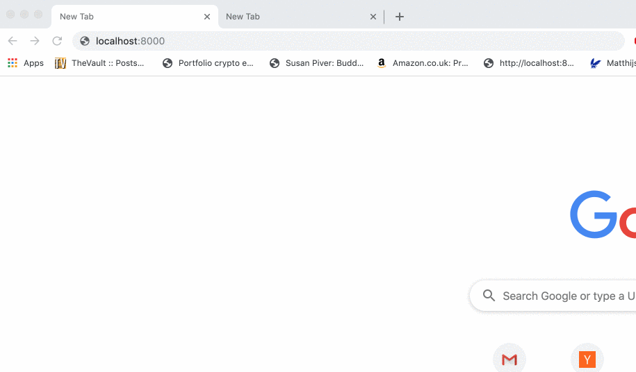

# Stripped Bugout

I deleted:

- RPC calls
- Encrypted message passing

All for the purposes of education!

I created a hello world example app with it that isn't client/server based but purely made up of peers.

All of this could be gleaned/learned from the original Bugout repository. But it took me hours to understand what the library is doing, and then I finally figured out that the library itself was what I needed. For me, the encryption and RPC calls were what made it a bit confusing to understand, which is why I made this simple hello world app.

If all you need is unencrypted message passing, then this stripped version of bugout with a "hello world" example boilerplate is what you need!

## Demo

## Installation

Do:

`npm install`

And modify the following in client.js:

In client.js the `swarmId` needs to be changed from `undefined` to a string of your liking.

## Usage

I only know how to do it on Mac. You need to bundle it with Browserify and then launch it on Chrome (or another compatible browser).

To bundle do:

`browserify client.js > bundle.js`

If you also want to startup Chrome:

`browserify client.js > bundle.js && open -a "Google Chrome" index.html`
